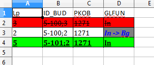

# KartEl

Projekt mający na celu porównywanie ze sobą dwóch plików .xlsx w celu wychwycenia
wszystkich zmian: dodane, usunięte lub zmodyfikowane wiersze.

## Od czego zacząć

W wersji podstawowej program służy do porównywania **kart**otek **el**ektronicznych
dając możliwość wychwycenia zmiana dla poszczególnych budynków, jednak przy odpowiedniej
konfiguracji będzie można porównywać również inne rodzaje danych.

### Biblioteki

Zanim zaczniesz pracować z roboczą wersją programu kartel, zainstaluj w swoim środowisku następujące biblioteki:

```
pip install openpyxl
pip install PySimpleGUI
```

### Pierwsze kroki

Aby rozpocząć porównywanie plików należy uruchomić program

```
python gui.py
```


Powyżej główne okno programu w którym wskazujemy pliki do porównania oraz 
ustalamy parametry dla danych w plikach xlsx

* numer arkusza - arkusz w którym znajdują się dane do porównania

* kolumna danych - numer kolumny w której zaczynają się dane

* wiersz nagłówka - numer wiersza od którego zaczyna się nagłówek danych

* wiersz danych - numer wiersza od którego zaczynają się dane

* id - numer kolumny która zawiera unikatowy identyfikator danych

  * dwa numery rozdzielone przecinkiem to dwie kolumny z których program stworzy jeden identyfikator
  * jeden numer to kolumna z jednoznacznym identyfikatorem
  * puste pole - program automatycznie zanumeruje wiersze od 1 (opcja przydatna gdy wiersze nie są usuwane z plików )

* ścieżki do plików służą do wskazania plików które chcemy ze sobą porównać

  Poniżej wynik działania programu na przykładowych danych z katalogu "/_example_data"
  raport wynikowy w postaci pliku raport.xlsx jest tworzony w głównym katalogu z programem.

  

  Kolorem czerwonym zaznaczono dane usunięte, kolorem zielonym dane dodane, w przypadku modyfikacji w polu zaznaczony na szaro mamy zarówno wartość pierwotną jak i aktualną.

  **UWAGA**

  W przypadku gdy porównywanie danych trwa dość długo, należy najpierw w excelu zaznaczyć wszystkie puste wiersze (od miejsca w którym kończą się dane do końca arkusza) a następnie 
  PPM -> Usuń wiersze - sposób ten dotyczy przypadków kiedy w tym arkuszu w dalszych wierszach był wcześniej jakieś dane ale zostały ręcznie usunięte. Program nie zignoruje tych pustych wierszy i będzie je analizował. W przypadku ok 1000 wierszy danych w obu plikach wynikowy raport powinniśmy otrzymać w czasie rzeczywistym.

## Uruchamianie testów

Testowanie z wykorzystaniem pytest, poniżej przykładowe polecenie generujące raport z testów wraz pokryciem kodu testami

```o
python -m pytest --cov-report term-missing --cov=kartel .
```

## Wykorzystane biblioteki

* [OpenPyXL](https://openpyxl.readthedocs.io/en/stable/) - A Python library to read/write Excel 2010 xlsx/xlsm file
* [PySimpleGUI](https://pysimplegui.readthedocs.io/en/latest/) - Python GUIs For Humans


## Przyszłość

Poniżej kilka pomysłów które być może zostaną ujęte w przyszłości:

* zmiana biblioteki interfejsu graficznego na standardowy tkinter 
* dodanie opcji konfiguracyjnych umożliwających utworzenie kilku zbiorów ustawień wejściowych zależnie od tego jakie dane chcemy ze sobą porównać


## Autor

* **Jakub Plata** - [geokodzilla](https://github.com/geokodzilla)

## Licencja

Projekt na licencji MIT License - szczegóły w pliku [LICENSE.md](LICENSE.md) 
