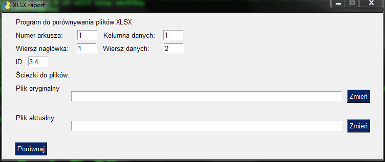

# KartEl

Projekt mający na celu porównywanie ze sobą dwóch plików .xlsx w celu wychwycenia
wszystkich zmian: dodane, usunięte lub zmodyfikowane wiersze.

## Od czego zacząć

W wersji podstawowej program służy do porównywania **kart**otek **el**ektronicznych
dając możliwość wychwycenia zmiana dla poszczególnych budynków, jednak przy odpowiedniej
konfiguracji będzie można porównywać również inne rodzaje danych.

### Biblioteki

Zanim zaczniesz pracować z roboczą wersją programu kartel, zainstaluj w swoim środowisku następujące biblioteki:

```
pip install openpyxl
pip install PySimpleGUI
```

### Pierwsze kroki

Aby rozpocząć porównywanie plików należy uruchomić program

```
python gui.py
```



Powyżej główne okno programu w którym wskazujemy pliki do porównania oraz 
ustalamy parametry dla danych w plikach xlsx

## Uruchamianie testów

Testowanie z wykorzystaniem pytest, poniżej polecenie generujące raport z pokryciem kodu testami

```o
python3 -m pytest --cov-report term-missing --cov=kartel .
```

## Wykorzystane biblioteki

* [OpenPyXL](https://openpyxl.readthedocs.io/en/stable/) - A Python library to read/write Excel 2010 xlsx/xlsm file
* [PySimpleGUI](https://pysimplegui.readthedocs.io/en/latest/) - Python GUIs For Humans

## Autor

* **Jakub Plata** - [geokodzilla](https://github.com/geokodzilla)

## Licencja

Projekt na licencji MIT License - szczegóły w pliku [LICENSE.md](LICENSE.md) 
